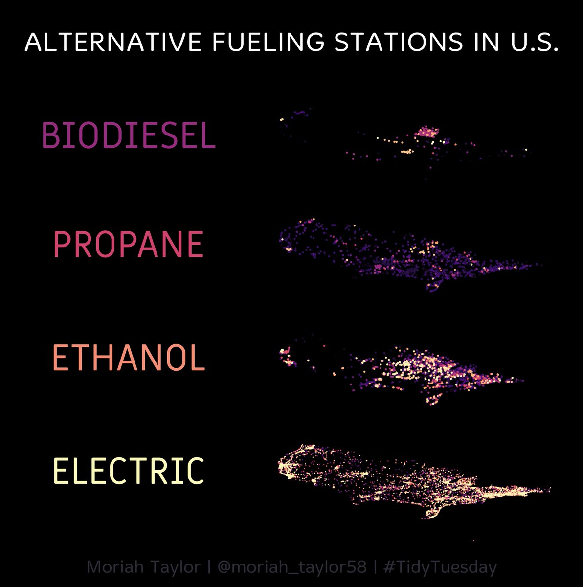

Today, we want to write about "social data challenges". Programmers partake in a series of prompts designed for a variety of skill sets and skill levels. Participants use them as an opportunity to practice their programming skills, work on algorithmic efficiency, or challenge themselves to learn something new. Often, participants share the code for their submissions, helping others learn how to apply new techniques to their work.

The prompts are time-bound or time-specific but flexible in their execution. For example, the [30 Day Map Challenge](https://github.com/tjukanovt/30DayMapChallenge) challenges participants to create something new every day in November.

Although these projects are often language-agnostic, R users often take part. For example, [genuary](http://genuary.art/) invites programmers to create generative art based on a new prompt every day in January. R users creatively apply their coding skills to create stunning works of design. On Day 6 of genuary, [Ryan Timpe](https://twitter.com/ryantimpe) “destroys the square”:


[Taking a look at the code](https://github.com/ryantimpe/genuary2022/blob/main/R/gen_05.R), we can see applications of R that go beyond statistics and data science. We learn how to plot a square in R:

```
library(tidyverse)
set.seed(12238)

#The square

square_size = 400

the_square <- expand_grid(
  x=1:square_size,
  y=1:square_size
) %>%
  mutate(
    color = "#87ceeb"
  )

plot(the_square$x, the_square$y)
```

We can also see how Ryan inserted randomness in the plot,  through strategic use of functions like `sample()` and `runif()`:

```
circ_origin_size = square_size * runif(1, 2/4, 3/4) 
```

[TidyTuesday](https://github.com/rfordatascience/tidytuesday) is another example of a social data project. Borne out of the R4DS Online Learning Community and the R for Data Science textbook, RStudio’s own [Tom Mock](https://twitter.com/thomas_mock) shares a dataset for participants every Tuesday. TidyTuesday encourages R users to make meaningful charts with ggplot2, tidyr, dplyr, and other tools in the tidyverse ecosystem (although, participants are free to use whatever package they’d like).

[Moriah Taylor](https://twitter.com/moriah_taylor58) visualizes alternative fueling stations in the U.S. using the [layer](https://cran.r-project.org/web/packages/layer/index.html) package. The use of stacked tilted maps communicates relationships, density, and location while being visually beautiful.


Interested in participating in a social data challenge? The [30 Day Chart Challenge](https://twitter.com/30DayChartChall) offers a new chart type for every day in April. First up is visualizing parts-to-whole. Showcase your R skills, challenge your perseverance, and use the hashtag `#30DayChartChallenge` to share your work with other participants!

We have started to compile a list of social data challenges. Please add a comment if you are aware of others.

| Timeframe               | Name                   | URL                                                 |   |
|-------------------------|------------------------|-----------------------------------------------------|---|
| January                 | genuary                | http://genuary.art/                                 |   |
| April                   | 30 Day Chart Challenge | https://twitter.com/30DayChartChall                 |   |
| October                 | Hacktoberfest          | https://hacktoberfest.digitalocean.com/             |   |
| November                | 30 Day Map Challenge   | https://github.com/tjukanovt/30DayMapChallenge      |   |
| December                | Advent of Code         | https://adventofcode.com/                           |   |
| Monday                  | Makeover Monday        | https://www.makeovermonday.co.uk/                   |   |
| Tuesday                 | Tidy Tuesday           | https://github.com/rfordatascience/tidytuesday      |   |
| Thursday, Summer Months | Recreation Thursday    | https://github.com/sharlagelfand/RecreationThursday |   |
| Sunday                  | SportsViz Sundays      | https://data.world/sportsvizsunday                  |   |
| Monthly                 | SWD                    | https://community.storytellingwithdata.com/         |   |
| Ongoing                 | 100 Days of Code       | https://www.100daysofcode.com/                      |   |