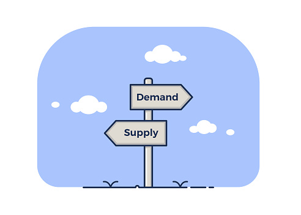

```{r setup, include=FALSE}

library(readr)
library(dplyr)
library(stringr)
library(lubridate)
library(tidyverse)
library(reactable)
library(reactablefmtr)
library(highcharter)
library(DT)
library(knitr)
library(sparkline)
library(scales)
library(collapsibleTree)
library(htmltools)


```

# 1) Introduction

## 1.1) The "problem" we aim to solve

{width="154"}

When we work in Demand & Supply Planning, it's pretty common that we need to calculate **projected inventories** (and related **projected coverages**).\
We often have 3 options to perform this calculation, using:

-   an APS (Advanced Planning System) software

-   an ERP : for example SAP or JDE

-   and of course...Excel!

All are fine, and have different pros and cons.

For example, we simply sometimes don't have all the data in our ERP either APS, like :

-   when we work with third parties Distributors

-   or we want to model a supply chain network which relies on different systems with unconnected data

> The idea here is...**how about using R to perform this calculation** ?

-   how simple and fast could it be?

-   and, could we do more than just the calculation?

    -   For example getting (as an output of a function) an analysis of the projected situation of a portfolio?

    -   So we don't have to look at each product one by one, and can instead :

        -   easily get a summary view of the portfolio

        -   then zoom on the products with risks of shortages or overstocks

## 1.2) Calculation through R

{width="154"}

> Let's use 2 functions from the **planr package**:

-   **proj_inv()** : to calculate projected inventories and coverages, with also some analysis features

-   **light_proj_inv()** : to calculate projected inventories and coverages (only).

    -   Runs faster than the previous function (as it's lighter and doesn't provide any analysis features).

    -   Useful in some cases (see the part "Other Calculations" for example)

Those 2 simple functions can easily be used and combined to perform more complex tasks, such as:

-   modeling of a Supply Chain Network

-   calculation of projected inventories from raw Materials to Finished Goods

-   a multi-echelons distribution network: from a national Distribution Center to Regional Wholesalers to Retailers

Becoming then an useful tool :

-   to build easily an End-to-End Supply Chain monitoring

-   to support the S&OP (Sales and Operations Planning) process, allowing us to run quickly some scenarios:

    -   Change of Sales plan

    -   Change of Supply (Production) plan

    -   Change of stocks levels parameters

    -   Change of Transit Time - etc...

> Moving forward:

This calculation is the basis for a classic second one: **a DRP (Distribution Requirement Planning)** calculation, where, based on some parameters (usually levels of stocks min & max, a reorder quantity and a frozen horizon) we calculate a Replenishment Plan.

More about this other function in another part.

## 1.3) Methodology

### 1.3.1) How to calculate projected inventories

Let's have a look at the example below, and consider that the field Demand = Sales Forecasts.

We start with some [Opening Inventories] of 1000 units.

-   During the month M we sell 100 un (the Demand). At the end of the 1st period (Month M), it remains 900un.

-   Then 800un at the end of the following period (Month M+1).

-   During the period (Month M+2) we get a Supply of 400un, and sell 100: it remains 1100un in stocks.

That's all, this how we calculate projected inventories :)

(and what the functions proj_inv() and light_proj_inv() are doing)


### 1.3.2) How to calculate projected coverages

The idea: we look forward.

We consider the projected inventories we have at the end of a period, and evaluate the related coverage **based on the coming Demand**. See example below:


If we use excel, we often see a "shortcut" to estimate the related coverages, like considering an average of the Demand of the next 3 or 6 months.

This can lead to some quite wrong results if the Demand is not constant (if we have some seasonalities or a strong trend for example).

> It becomes very easy through the proj_inv() and light_proj_inv() functions.

# 2) Use Cases : examples

## 2.1) 3rd Party Distributor

We sometimes work with 3rd Parties Distributors to distribute our products. A common question is: how much stocks do our partners hold?

> If we have access to their opening inventories and Sales IN & OUT Forecasts, we can quickly calculate the projected inventories, apply the proj_inv() or light_proj_inv() functions

And then anticipate any risks of shortages or overstocks, and create a collaborative work.


## 2.2) From Raw Materials to Finished Goods

In the example below, we produce olive oil (could be shampoo, liquor, etc).

We start with a first raw material, the olive oil, that we use to fill up different sizes of bottles (35cl, 50cl,...), on which we then apply (stick) a label (and back label).

There are different types of labels, depending on the languages (markets where the products are sold).

Once we have a labelled bottle, we then put it inside an outer box, ready to be shipped, and sold. There are different dimensions of outer boxes, where we can put for example 4, 6 or 12 bottles. T**hey are the Finished Goods.**

We have 2 groups of products here:

-   Finished Goods

-   Semi-Finished: at different steps, filled bottle (not yet labelled), or labelled bottle

We might me interested in l**ooking at the projected inventories at different levels / steps of the manufacturing process:**

-   Finished Goods

-   Raw Materials : naked bottles, labels or the liquid (Olive Oil)

-   Semi-Finished products

> For this: we can apply the proj_inv() or light_proj_inv() functions on each level of analysis


## 2.3) Multi Echelons network

In the example below: we are looking at the distribution network within a country.

The products are stored at different locations:

-   at a Central Stock: managed by the company selling the products. For example a National Distribution Center.

-   then at some 3rd parties:

    -   who buy those products to distribute and sell them in more specific areas, or regions

    -   a network of Wholesalers and then Sub-Wholesalers for example

> if we have access to the data of the 3rd parties, such as [Opening Inventories] and [Sales IN & OUT Forecasts], we could apply the proj_inv() or light_proj_inv() functions on each level and visualize the complete projected inventories within the Distribution Network

{width="522"}

## 2.4) From Production Capacities to Sales

In the example below: we have 1 or several Factories (within the box "Production Capacities") which supply a [Global Stocks] which is then used to supply directly some markets and a [Regional Stocks].

The [Regional Stocks] is then supplying other markets as well as a 3rd Party Distributor.

**We would like to manage the Monthly S&OP process.**

-   Linking Sales & Manufacturing Operations through a simple modeling.

-   To balance Demand & Supply over the medium-long term horizon.

-   Visualizing some impacts through the whole distribution network

**and make some simulations and drive some decisions :**

-   Change of Sales Plan

-   Change of Supply Plan

-   Change of Inventories Level

-   Change of Transit Lead Time

-   Change of Product Mix ...

> we could apply the proj_inv() or light_proj_inv() functions on each level and visualize the complete projected inventories within the Distribution Network


# 3) Overview of the demo dataset

Let's upload the demo dataset "Blueprint_DB.csv" :

```{r}

Blueprint_DB <- read_csv("Blueprint_DB.csv", 
    col_types = cols(DFU = col_character(), 
        Period = col_date(format = "%Y-%m-%d")))


glimpse(Blueprint_DB)


```

**The [Blueprint_DB] dataset has 7 fields:**\

-   **DFU** : stands for "Demand Forecast Unit".

    -   It's basically one product (also called SKU, "Storage Keeping Unit"), with a little more characteristics, for example a SKU sold in one particular distribution channel

-   **Period** : the horizon of time where we are going to project our calculation of inventories.

    -   It could be monthly, weekly, daily (and so on) buckets, over a certain range of periods, for example 24 months or 52 weeks.

-   **Demand** : the Demand Forecasts for each period of time.

    -   Expressed in units.

    -   This could be Sales Forecasts or Replenishment Forecasts (if we ship to one warehouse to replenish it) for example.

-   **Opening Inventories** : our available stocks at the beginning of the horizon.

    -   Expressed in units.

-   **Supply Plan** : the quantities that we will receive to replenish our stocks.

    -   A certain quantity at a given time.

    -   Expressed in units.

-   **Min Stocks Coverage** : a parameter of minimum stocks.

    -   Expressed in number of periods of coverage.

    -   If we put 2 months, it means that we aim to maintain a minimum stocks coverage of 2 months, based on the Demand Forecasts.

-   **Max Stocks Coverage** : a parameter of maximum stocks.

    -   Expressed in number of periods of coverage.

    -   If we put 6 months, it means that we aim to maintain our stocks below a coverage of 6 months, based on the Demand Forecasts.

Let's explore a bit more the size of the portfolio:

```{r}

# keep only some needed columns
df1 <- Blueprint_DB %>% select(DFU, Period, Demand)

# spread
df1 <- df1 %>% spread(Period, Demand)

head(df1)

```

It's a portfolio of :

-   50 DFUs (items)

-   the field Period is in weekly bucket

-   an horizon of time of 52 weeks

Let's look closer at one product, for example the "Item 000008" :

```{r}

df1 <- filter(Blueprint_DB, Blueprint_DB$DFU == "Item 000008")

df1

```

We can see the 3 groups of data:

-   **Some Dimensions** : [DFU] and [Period]

-   **Demand and Supply Planning values** : [Demand] / [Opening Inventories] / [Supply Plan]

-   **Stocks Levels** : [Min.Stocks.Coverage] and [Max.Stocks.Coverage]

# 4) Calculation of the Projected Inventories

We are going to calculate 2 things, applying the methodology we saw previously:

-   **Projected Inventories**

    -   definition: [Stocks at the beginning of a Period of time] - [Demand of the Period] + [Supply Plan to be received during this Period]

    -   at the very beginning: [Stocks at the beginning of a Period of time] = [Opening Inventories]

-   **Related Projected Coverages**

    -   definition: how many periods of Demand (forecasts) do the Projected Inventories of a Period of time cover

## 4.1) Run proj_inv()

> Let's apply the function proj_inv() to the whole demo dataset

```{r}

# Get the proj_inv() function
source("proj-inv-function.R")

# Get the light_proj_inv() function
source("light-proj-inv-function.R")

```


```{r}

# create a calculated database for the Projected Inventories @ DFU level
Calculated_DB <- proj_inv(data = Blueprint_DB, 
                    DFU = DFU, 
                    Period = Period, 
                    Demand =  Demand, 
                    Opening.Inventories = Opening.Inventories, 
                    Supply.Plan = Supply.Plan,
                    Min.Stocks.Coverage = Min.Stocks.Coverage, 
                    Max.Stocks.Coverage = Max.Stocks.Coverage)


```

Let's have a look at it:

```{r}

head(Calculated_DB)

```

Let's look closer at one product:

```{r}

df1 <- as.data.frame(Calculated_DB)

# let's look at the Item 000008
df1 <- filter(df1, df1$DFU == "Item 000008")


# we can also make the horizon of display shorter
df1 <- subset(df1,  df1$Period <= '2022-12-01')


# get Results
Example_DB <- df1

head(Example_DB)

```

And have a look at it using the reactable package:

```{r}

# set a working df
df1 <- Example_DB


# create a reactable
    reactable(df1, 
              
              striped = TRUE, highlight = TRUE, compact = TRUE, 
              defaultPageSize = 10,
              
              columns = list(
                
                
                #-----------------------
                # Initial values
                
                `Demand`= colDef(
                  name = "Demand",
                  format = colFormat(separators = TRUE, digits=0)
                ),
                
                `Opening.Inventories`= colDef(
                  name = "Opening Inventories",
                  format = colFormat(separators = TRUE, digits=0)
                ),
                
                `Supply.Plan`= colDef(
                  name = "Supply Plan",
                  format = colFormat(separators = TRUE, digits=0)
                ),
                
                
                
                #-----------------------
                # Calculated Projections
                
                
                `Calculated.Coverage.in.Periods`= colDef(
                  name = "Calculated Coverage in Periods",
                  style = list(background = "yellow")
                ),
                
                `Projected.Inventories.Qty`= colDef(
                  name = "Projected Inventories Qty",
                  format = colFormat(separators = TRUE, digits=0),
                  style = list(background = "yellow")
                ),
                
                
                
                
                #-----------------------
                # Projected Min & Max
                
                `Safety.Stocks`= colDef(
                  name = "Safety Stocks",
                  format = colFormat(separators = TRUE, digits=0),
                  style = list(background = "lightgreen")
                ),

                `Maximum.Stocks`= colDef(
                  name = "Maximum Stocks",
                  format = colFormat(separators = TRUE, digits=0),
                  style = list(background = "lightgreen")
                ),
                
                
                
                #-----------------------
                # Analysis Features
                
                `PI.Index`= colDef(
                  name = "PI Index",
                  style = list(background = "lightblue")
                ),
                
                `Ratio.PI.vs.min`= colDef(
                  name = "Ratio PI vs min",
                  style = list(background = "lightblue")
                ),
                
                `Ratio.PI.vs.Max`= colDef(
                  name = "Ratio PI vs Max'",
                  style = list(background = "lightblue")
                )
                


              ), # close columns lits
              
              columnGroups = list(
                colGroup(name = "Calculation of Projected Inventories & Coverages",
                         columns = c("Calculated.Coverage.in.Periods",
                                     "Projected.Inventories.Qty")),

                colGroup(name = "Projected Stocks Targets", columns = c("Safety.Stocks",
                                                                 "Maximum.Stocks")),

                colGroup(name = "Analysis Features", columns = c("PI.Index",
                                                                 "Ratio.PI.vs.min",
                                                                 "Ratio.PI.vs.Max"))
              )
              
    ) # close reactable
    


```

> After Calculation using proj_inv(), we got 2 new groups of columns, giving us a complete database for an automated analysis (more about it later on).

-   **1st group: some calculated columns**

    -   calculation of Projected Inventories & Coverages : the basics of the calculation

    -   projected Stocks Targets (min & Max) in units : useful for further analysis (below)

-   **2nd group: some Analysis Features**

    -   to automate the screening and facilitate the decistion taking process:

        -   Projected Inventories Index: basically, how are the [projected inventories] (OK, alert, shortage, overstocks)

        -   a ratio [Projected Inventories] vs [Minimum Stocks Target] : used w/ a threshold filter, allows to quickly identify the relevant SKUs

        -   a ratio [Projected Inventories] vs [Maximum Stocks Target] : same w/ above

## 4.2) Let's make a better visual

The previous table looked full of nice and useful columns, but well, it's not super appealing when we look at it :)

So let's make it a bit nicer.

### 4.2.1) Display of the complete calculated table

For a selected item.

Through the calculated fields [Analysis Features], we have several information available, which are useful for a mass analysis, when we want to build a Cockpit or a Supply Risks Alarm for example.

Let's keep those fields here.

First, we can create a little function that we will use inside the next table:

```{r}

#--------------------------------------------------------------------------------------
#    A Function for the status_PI.Index
#--------------------------------------------------------------------------------------

# create a function status.PI.Index
status_PI.Index <- function(color = "#aaa", width = "0.55rem", height = width) {
  span(style = list(
    display = "inline-block",
    marginRight = "0.5rem",
    width = width,
    height = height,
    backgroundColor = color,
    borderRadius = "50%"
  ))
}


```

Now let's create a reactable:

```{r}

# set a working df
df1 <- Example_DB


#-------------------------
# Transform
    
# remove not needed column
df1 <- df1[ , -which(names(df1) %in% c("DFU"))]
    
    
# create a f_colorpal field
df1 <- df1 %>% mutate(f_colorpal = case_when( Calculated.Coverage.in.Periods > 8 ~ "#FFA500", 
                                                  Calculated.Coverage.in.Periods > 2 ~ "#32CD32",
                                                  Calculated.Coverage.in.Periods > 0 ~ "#FFFF99",
                                                  TRUE ~ "#FF0000" ))
    
    
    
    #-------------------------
    # Create Table
    
    
    
    reactable(df1, resizable = TRUE, showPageSizeOptions = TRUE, 
              
              striped = TRUE, highlight = TRUE, compact = TRUE, 
              defaultPageSize = 20,
              
              columns = list(
                


                
                
                Demand = colDef(
                  name = "Demand (units)",
                  
                  cell = data_bars(df1, 
                                   fill_color = "#3fc1c9",
                                   text_position = "outside-end"
                  )
                  
                ),
                
                
                

                
                
                Calculated.Coverage.in.Periods = colDef(
                  name = "Coverage (Periods)",
                  maxWidth = 90,
                  
                  cell= color_tiles(df1, color_ref = "f_colorpal")
                ),
                
                
                f_colorpal = colDef(show = FALSE), # hidden, just used for the coverages
                

                
                `Projected.Inventories.Qty`= colDef(
                  name = "Projected Inventories (units)",
                  format = colFormat(separators = TRUE, digits=0),
                  
                  style = function(value) {
                    if (value > 0) {
                      color <- "#008000"
                    } else if (value < 0) {
                      color <- "#e00000"
                    } else {
                      color <- "#777"
                    }
                    list(color = color
                         #fontWeight = "bold"
                    )
                  }
                ),
                
                

                
                
                Supply.Plan = colDef(
                  name = "Supply (units)",
                  cell = data_bars(df1, 
                                   
                                   #round_edges = TRUE
                                   #value <- format(value, big.mark = ","),
                                   #number_fmt = big.mark = ",",
                                   fill_color = "#3CB371",
                                   #fill_opacity = 0.8, 
                                   text_position = "outside-end"
                  )
                ),
                
                
                
                PI.Index = colDef(
                  name = "Analysis",
                  
                  cell = function(value) {
                    color <- switch(
                      value,
                      TBC = "hsl(154, 3%, 50%)",
                      OverStock = "hsl(214, 45%, 50%)",
                      OK = "hsl(154, 64%, 50%)",
                      Alert = "hsl(30, 97%, 70%)",
                      Shortage = "hsl(3, 69%, 50%)"
                    )
                    PI.Index <- status_PI.Index(color = color)
                    tagList(PI.Index, value)
                  }),
                
                
                
                `Safety.Stocks`= colDef(
                  name = "Safety Stocks (units)",
                  format = colFormat(separators = TRUE, digits=0)
                ),
                
                `Maximum.Stocks`= colDef(
                  name = "Maximum Stocks (units)",
                  format = colFormat(separators = TRUE, digits=0)
                ),
                
                `Opening.Inventories`= colDef(
                  name = "Opening Inventories (units)",
                  format = colFormat(separators = TRUE, digits=0)
                ),
                
                
                `Min.Stocks.Coverage`= colDef(name = "Min Stocks Coverage (Periods)"),
                
                `Max.Stocks.Coverage`= colDef(name = "Maximum Stocks Coverage (Periods)"),
                
                
                # ratios
                `Ratio.PI.vs.min`= colDef(name = "Ratio PI vs min"),
                
                `Ratio.PI.vs.Max`= colDef(name = "Ratio PI vs Max")
                
                
                
                
              ), # close columns lits
              
              columnGroups = list(
                colGroup(name = "Projected Inventories", columns = c("Calculated.Coverage.in.Periods", 
                                                                     "Projected.Inventories.Qty")),
                
                colGroup(name = "Stocks Levels Parameters", columns = c("Min.Stocks.Coverage", 
                                                                        "Max.Stocks.Coverage",
                                                                        "Safety.Stocks",
                                                                        "Maximum.Stocks")),
                
                colGroup(name = "Analysis Features", columns = c("PI.Index", 
                                                                        "Ratio.PI.vs.min",
                                                                        "Ratio.PI.vs.Max"))
                
              )
              
    ) # close reactable


```

It looks nicer ! ...but yes, perhaps it's too detailed for a focus on a SKU.

An alternative could be:

-   a more compact table

-   and some charts aside

> Let's see the Compact view for a more simple display.

### 4.2.2) A more compact view

#### Minimalistic Table

We just keep the most "useful" fields:

```{r}


# get data
df1 <- Example_DB
    
    
    
#-------------------------
# Transform
    
# keep only the needed columns
df1 <- df1 %>% select(Period,
                          Demand,
                          Calculated.Coverage.in.Periods,
                          Projected.Inventories.Qty,
                          Supply.Plan)
    
    
# create a f_colorpal field

df1$Calculated.Coverage.in.Periods <- as.numeric(df1$Calculated.Coverage.in.Periods)

df1 <- df1 %>% mutate(f_colorpal = case_when( Calculated.Coverage.in.Periods > 8 ~ "#FFA500", 
                                                  Calculated.Coverage.in.Periods > 2 ~ "#32CD32",
                                                  Calculated.Coverage.in.Periods > 0 ~ "#FFFF99",
                                                  TRUE ~ "#FF0000" ))
    
    

    
    
    
#-------------------------
# Create Table
    
    
    
    reactable(df1, resizable = TRUE, showPageSizeOptions = TRUE, 
              
              striped = TRUE, highlight = TRUE, compact = TRUE, 
              defaultPageSize = 20,
              
              columns = list(
                
                
                
                Demand = colDef(
                  name = "Demand (units)",
                  
                  cell = data_bars(df1, 
                                   fill_color = "#3fc1c9",
                                   text_position = "outside-end"
                  )
                  
                ),
                


              Calculated.Coverage.in.Periods = colDef(
                name = "Coverage (Periods)",
                maxWidth = 90,
                
                cell= color_tiles(df1, color_ref = "f_colorpal")
              ),
                
                
              f_colorpal = colDef(show = FALSE), # hidden, just used for the coverages
                
                
                
                `Projected.Inventories.Qty`= colDef(
                  name = "Projected Inventories (units)",
                  format = colFormat(separators = TRUE, digits=0),
                  
                  style = function(value) {
                    if (value > 0) {
                      color <- "#008000"
                    } else if (value < 0) {
                      color <- "#e00000"
                    } else {
                      color <- "#777"
                    }
                    list(color = color
                         #fontWeight = "bold"
                    )
                  }
                ),
                
                

              
              Supply.Plan = colDef(
                name = "Supply (units)",
                cell = data_bars(df1, 
                                 fill_color = "#3CB371",
                                 text_position = "outside-end"
                                 )
                )

                
                
                
                
              ), # close columns lits
              
              columnGroups = list(
                colGroup(name = "Projected Inventories", columns = c("Calculated.Coverage.in.Periods", 
                                                                     "Projected.Inventories.Qty"))
                

              )
              
    ) # close reactable


```

#### And some Charts

We can display some projected inventories, using the highcharter package.

For example here a projection vs minimum and maximum stocks targets:

```{r}


# get data
df1 <- Example_DB
    
    
    
#---------------------------------
# chart
    p <- highchart() %>% 
      hc_add_series(name = "Max", color = "crimson", data = df1$Maximum.Stocks) %>% 
      hc_add_series(name = "min", color = "lightblue", data = df1$Safety.Stocks) %>% 
      hc_add_series(name = "Projected Inventories", color = "gold", data = df1$Projected.Inventories.Qty) %>% 
      
      hc_title(text = "Projected Inventories") %>%
      hc_subtitle(text = "in units") %>% 
      hc_xAxis(categories = df1$Period) %>% 
      #hc_yAxis(title = list(text = "Sales (units)")) %>% 
      hc_add_theme(hc_theme_google())
    
    p

```

Or here a more visual projection of the inventories, showing the Shortages, if any:

```{r}

#-------------------------
# get data
df1 <- Example_DB
    
    

    
#-------------------------
# Transform
    
#-------------------------
# keep only needed columns and reorder
df1<-df1[,c("Period","Projected.Inventories.Qty")]
    
# create a value.index
df1$Value.Index <- if_else(df1$Projected.Inventories.Qty < 0, "Shortage", "Stock")
    
    
# spread
df1<-df1 %>% spread(Value.Index, Projected.Inventories.Qty)
    
    
#----------------------------------------------------
# Chart
    
    u<-highchart() %>% 
      hc_title(text = "Projected Inventories") %>%
      hc_subtitle(text = "in units") %>% 
      hc_add_theme(hc_theme_google()) %>%
      
      hc_xAxis(categories = df1$Period) %>% 
      
      hc_add_series(name = "Stock", 
                    color = "#32CD32",
                    #dataLabels = list(align = "center", enabled = TRUE),
                    data = df1$Stock) %>% 
      
      hc_add_series(name = "Shortage", 
                    color = "#dc3220",
                    #dataLabels = list(align = "center", enabled = TRUE),
                    data = df1$Shortage) %>% 
      
      hc_chart(type = "column") %>% 
      hc_plotOptions(series = list(stacking = "normal"))
    
    u 
    
    
    

  


```

# 5) Let's use the Analysis Features!

We saw that we have 3 fields related to the "Analysis Features":

-   **a PI Index :** indicates us whether the projected inventories over a defined horizon present

    -   an Alert : we are below the minimum Stocks Target

    -   a Shortage : no more stocks

    -   OK : projected stocks are between the targeted minimum and maximum levels. No problems!

    -   an OverStock situation : we are above the Maximum Stocks Target

-   **a [Ratio PI vs minimum Stocks Targets] :**

    -   useful to quantify by how much (in %) we are below the minimum Stocks Target

-   **a [Ratio PI vs Maximum Stocks Targets] :**

    -   useful to quantify by how much (in %) we are above the Maximum Stocks Target

*Where PI stands for "Projected Inventories".*

> Let's use those features to build a Cockpit and a Supply Risks Alarm (they make the task very easy!).

## 5.1) Build a Cockpit

Here is an example of Cockpit with 4 parts.

Before, let's subset our data:

-   selecting a certain horizon of analysis

-   and also eventually a certain group of products

```{r}

# get data
df1 <- Calculated_DB
    
#-------------------------
# Filters
   
# subset Period based on those Starting and Ending Periods
df1 <- subset(df1,df1$Period >= '2022-07-03' & df1$Period <= '2022-12-30' )
    
    
#-------------------
# Keep Initial_DB
#-------------------
    
Initial_DB <- df1


```

Now, let's build our cockpit.

### 5.1.1) Summary

We can start with a first part:

```{r}

#-------------------------
# Transform
    
    
#-------------------
# Create Value_DB
#-------------------
    
# aggregation
df1 <- Initial_DB %>% select(DFU, Demand, Opening.Inventories) %>%
      group_by(DFU) %>%
      summarise(Total.Demand = sum(Demand),
                Opening.Inventories = sum(Opening.Inventories)
      )
    
# Get results
Value_DB <- df1
    
    
# Create a dataframe w/ a dummy row
DFU <- c("dummy")
Total.Demand <- c(0)
Opening.Inventories <- c(0)
    
Dummy_DB <- data.frame(DFU, Total.Demand, Opening.Inventories)
    
# Add Row
Value_DB <- rbind(Value_DB, Dummy_DB)

glimpse(Value_DB)


```

This is a summary of some interesting values by products:

-   Total Demand (over a selected horizon)

-   Opening inventories

It's often useful if we want to sort / look at the main products in terms of sales or volumes.

### 5.1.2) Supply Risks Alarm

We then can continue with a summary of a Supply Risks Alarm (SRA).

The approach is simple: we look at the different values of the PI.Index over the selected horizon and just display a summary table:

```{r}


#-------------------
# Create SRA Summary
#-------------------
    
    
#-------------------
# Create a Dummy database
# to ensure that all the different values of PI.Index appear, whatever SKU we select
DFU <- c("dummy", "dummy", "dummy", "dummy")
PI.Index <- c("Alert", "OK", "OverStock", "Shortage")
    
Dummy_DB <- data.frame(DFU, PI.Index)
    
# add it to Initial
df1 <- Initial_DB %>% select(DFU, PI.Index)
df1 <- rbind(df1, Dummy_DB)
    
    
    
# aggregation
df1 <- df1 %>% select(DFU, PI.Index) %>%
      group_by(DFU, PI.Index) %>%
      summarise(Nb.Occurences = n()
      )
    
    
# spread data
df1 <- df1 %>% spread(PI.Index, Nb.Occurences)
    
# replace missing values (NA) by zero
df1[is.na(df1)] <- 0
    
    
# Get results
SRA_Summary_DB <- df1


head(SRA_Summary_DB)


```

The result is a compact table, which informs us whether we need to have a deeper look at one product. **Basically, if we see and Alert, a Shortage or an OverStock situation.**

Moving forward, we can link the 2 previous databases:

```{r}

#-------------------
# Merge both databases
#-------------------
    
# merge
df1 <- left_join(Value_DB, SRA_Summary_DB)
    
# remove the rows related to dummy
df1 <- subset(df1, DFU!="dummy")
    
# Get Results
Interim_DB <- df1


head(Interim_DB)

```

Let's now make it a bit nicer and insightful, using some sparklines, to visualize:

-   the Demand

-   the Projected Inventories

### 5.1.3) Sparklines for Demand

```{r}


#-------------------
# Create Sparklines for Demand
#-------------------
    
    
    
# replace missing values by zero
Initial_DB$Demand[is.na(Initial_DB$Demand)] <- 0
    
# aggregate
df1 <- Initial_DB %>%
      group_by(
        DFU,
        Period
      ) %>%
      summarise(
        Quantity =sum(Demand)
      )
    
# generate Sparkline
Sparkline_DB <- df1 %>%
      group_by(DFU) %>%
      summarise(Quantity = list(Quantity))
    
    
    
#----------------------------------------
# Link both databases
    
df1 <- left_join(Interim_DB, Sparkline_DB)
    
# Get Results
Interim_DB <- df1
    
    
    

glimpse(Interim_DB)    


```

### 5.1.4) Sparklines for Projected Inventories

```{r}

#-------------------
# Create Sparklines for the Projected Inventories
#-------------------
    
    
    
# replace missing values by zero
Initial_DB$Projected.Inventories.Qty[is.na(Initial_DB$Projected.Inventories.Qty)] <- 0
    
# aggregate
df1 <- Initial_DB %>%
      group_by(
        DFU,
        Period
      ) %>%
      summarise(
        Quantity =sum(Projected.Inventories.Qty)
      )
    
    # generate Sparkline
    PI.Sparkline_DB <- df1 %>%
      group_by(DFU) %>%
      summarise(PI.Quantity = list(Quantity))
    
    
    
    
#----------------------------------------
# Link both databases
df1 <- left_join(Interim_DB, PI.Sparkline_DB)
    
    
    

glimpse(df1)    


```

### 5.1.5) Visualize

```{r}

# Reorder Columns
df1 <- df1 %>% select(DFU,
                          Opening.Inventories,
                          Total.Demand,
                          Quantity,
                          OK,
                          OverStock,
                          Alert,
                          Shortage,
                          PI.Quantity)


```

We will use a reactable

```{r}

reactable(df1,compact = TRUE,
              
              defaultSortOrder = "desc",
              defaultSorted = c("Total.Demand"),
              defaultPageSize = 10,
              
              columns = list(
                
                `DFU` = colDef(name = "Item", minWidth = 150),
                
                
                
                `Opening.Inventories`= colDef(
                  name = "Opening Inventories (units)",
                  aggregate = "sum", footer = function(values) formatC(sum(values),format="f", big.mark=",", digits=0),
                  format = colFormat(separators = TRUE, digits=0)
                  #style = list(background = "yellow",fontWeight = "bold")
                ),
                
                
                `Total.Demand`= colDef(
                  name = "Total Demand (units)",
                  aggregate = "sum", footer = function(values) formatC(sum(values),format="f", big.mark=",", digits=0),
                  format = colFormat(separators = TRUE, digits=0),
                  style = list(background = "yellow",fontWeight = "bold")
                ),
                
                
                Quantity = colDef(
                  name = "Demand",
                  cell = function(value, index) {
                    sparkline(df1$Quantity[[index]])
                  }),

                
                
                PI.Quantity = colDef(
                  name = "Projected Inventories",
                  cell = function(values) {
                    sparkline(values, type = "bar"
                    )
                  })
                
                
                
                
                
              ), # close columns list
              
              defaultColDef = colDef(footerStyle = list(fontWeight = "bold")),
              
              columnGroups = list(
                
                colGroup(name = "Demand Overview", 
                         columns = c("Total.Demand", "Quantity")),
                
                colGroup(name = "Projected Inventories Analysis", 
                         columns = c("OK", "OverStock", "Alert", "Shortage", "PI.Quantity"))
                

              )
              
    ) # close reactable
    

```

Done:)

Now we can have easily a glance on:

-   the evolution of the Demand

-   the projected inventories (displaying the periods with shortages through the red bars)

-   the products at risks of Shortage / Alert / OverStock

## 5.2) Create a Supply Risks Alarm

The approach is quite similar to the one we followed to build the Cockpit. This time, instead on the PI.Index, we will use the 2 other fields:

-   Ratio.PI.vs.min

-   Ratio.PI.vs.Max

> The idea is to facilitate the analysis of a portfolio, heading straight to the relevant products.

Just as we did for the Cockpit, let's define a perimeter of analysis:

-   an horizon of time

-   and eventually a group of products

```{r}

# get data
df1 <- Calculated_DB
    
#-------------------------
# Filters
   
# subset Period based on those Starting and Ending Periods
df1 <- subset(df1,df1$Period >= '2022-07-03' & df1$Period <= '2022-12-30' )
    
    
#-------------------
# Keep Initial_DB
#-------------------
    
Initial_DB <- df1


```

### 5.2.1) For Alerts & Shortages

When we use Shiny, we can create a widget to define and modify a threshold for the Alerts.

Displayed below as [Selected.Alerts.Threshold].

Here, let's put 0.8 : which means that we look only (i.e. we filter) at the Products for which the Projected Inventories will be below 80% of the Safety Stocks, at one moment over the selected horizon of analysis.

```{r}

#-------------------
# Get List of SKUs within a certain threshold
#-------------------
    
# set a working df
df1 <- Initial_DB
    
# Filter the rows keeping only the ones with a Ratio.PI.vs.min below a certain threshold
#df1 <- subset(df1,df1$Ratio.PI.vs.min <= input$Selected.Alerts.Threshold)
df1 <- subset(df1,df1$Ratio.PI.vs.min <= 0.8) 

   
# Get list of SKUs
df1 <- df1 %>% select(DFU)
df1 <- unique(df1)
    
# Get Results
Portfolio_DB <- df1
    
    
    
#-------------------
# Add Projected Ratio.PI.vs.min
#-------------------
    
# set a working df
df1 <- Initial_DB
    
# keep only the needed columns
df1 <- df1 %>% select(DFU, Period, Ratio.PI.vs.min)
    
# spread
df1<-df1 %>% spread(Period, Ratio.PI.vs.min)
    
# get Results
Projected_Ratio.PI.vs.min_DB <- df1
    
    
    
#-------------------
# Merge
#-------------------
    
# merge
df1 <- left_join(Portfolio_DB, Projected_Ratio.PI.vs.min_DB)
    
    

```

Let's make the display a bit nicer:

```{r}

datatable(df1, rownames = FALSE) %>%
      
      formatStyle(columns = c(1:100), fontSize = '90%') %>%
      
      formatStyle(
        2:60,
        
        backgroundColor = styleInterval(c(-0.1,0.0, 
                                          #input$Selected.Alerts.Threshold
                                          0.8
                                          ), 
                                        c('#FF6347', 'mediumseagreen', 'yellow','#FFFFFF'))
        
      ) 


```

As a complement to the Cockpit, which gave an overview, we here can see the duration of the Alert or Shortage situations, for a group of products.

### 5.2.2) For OverStocks

Very similar approach, but this time we use the feature [Ratio.PI.vs.Max].

As an example, we will define the threshold of analysis as 20% above the Maximum Stocks Targets.

```{r}


#-------------------
# Get List of SKUs within a certain threshold
#-------------------
    
# set a working df
df1 <- Initial_DB
    
# Filter the rows keeping only the ones with a Ratio.PI.vs.Max above a certain threshold
#df1 <- subset(df1,df1$Ratio.PI.vs.Max >= input$Selected.OverStocks.Threshold)
df1 <- subset(df1,df1$Ratio.PI.vs.Max >= 1.2) 
   
# Get list of SKUs
df1 <- df1 %>% select(DFU)
df1 <- unique(df1)
    
# Get Results
Portfolio_DB <- df1
    
    
    
#-------------------
# Add Projected Ratio.PI.vs.Max
#-------------------
    
# set a working df
df1 <- Initial_DB
    
# keep only the needed columns
df1 <- df1 %>% select(DFU, Period, Ratio.PI.vs.Max)
    
# spread
df1<-df1 %>% spread(Period, Ratio.PI.vs.Max)
    
# get Results
Projected_Ratio.PI.vs.Max_DB <- df1
    
    
    
#-------------------
# Merge
#-------------------
    
# merge
df1 <- left_join(Portfolio_DB, Projected_Ratio.PI.vs.Max_DB)
    
    


```

Let's make the display a bit nicer:

```{r}

datatable(df1, rownames = FALSE) %>%
      
      formatStyle(columns = c(1:100), fontSize = '90%') %>%
      
      formatStyle(
        2:60,
        
        backgroundColor = styleInterval(c(-0.1,0.0, 
                                          #input$Selected.OverStocks.Threshold
                                          1.2
                                          ), 
                                        c('#FFFFFF', '#FFFFFF', '#FFFFFF','lightblue'))
        
      ) 

```

# 6) Other Calculations

## 6.1) Aggregations

Now, let's imagine that each product belongs to a certain Product Family.

We would like to have a consolidated view of the Projected Inventories and Coverages at this Product Family level.

Let's upload a table to link the [Product Family] to each [DFU]:

```{r}

# Upload DFU_Product_Family_DB
DFU_Product_Family_DB <- read_csv("DFU_Product_Family_DB.csv",
                         col_types = cols(DFU = col_character()))


head(DFU_Product_Family_DB)


```

Let's represent this through a Collapsible Tree:

```{r}

# Get Data
Portfolio <- DFU_Product_Family_DB
    

    collapsibleTree(
      Portfolio,
      hierarchy = c("Product.Family", "DFU"),
      width = 800,
      zoomable = FALSE
    )


```

### 6.1.1) Calculation

Let's say that we want to get an aggregated view of the projected inventories & coverages for the Product Family "Family A".

We will:

-   aggregate the different values (Demand / Opening Inventories / Supply Plan) at this level

-   calculate the projected inventories.

    -   Note that here we just need a simple calculation (i.e. we don't need any Analysis Features), and **will then use the light_proj_inv() function**.

```{r}

#-------------------------
# get data
df1 <- Blueprint_DB
    
    
#-------------------------
# Transform
    
# merge
df1 <- left_join(Blueprint_DB, DFU_Product_Family_DB)
    
# filter on the Product.Family
df1 <- filter(df1, df1$Product.Family %in% c("Family A"))
    
    
# Add a dummy field
df1$Dummy <- "dummy"
    
# aggregate
df1 <- df1 %>% select(Dummy, Period, Demand, Opening.Inventories, Supply.Plan) %>%
      group_by(Dummy, Period) %>%
      summarise(Demand = sum(Demand),
                Opening.Inventories = sum(Opening.Inventories),
                Supply.Plan = sum(Supply.Plan)
      )
    
df1 <- as.data.frame(df1)
    
# rename columns
    df1 <- df1 %>% rename(
      'DFU' = Dummy
    )
    
# apply light_proj_inv()
df1 <- light_proj_inv(data = df1,
                          DFU = DFU,
                          Period = Period,
                          Demand =  Demand,
                          Opening.Inventories = Opening.Inventories,
                          Supply.Plan = Supply.Plan)
    
    
# remove not needed column
df1 <- df1[ , -which(names(df1) %in% c("DFU", "Opening.Inventories"))]
    
    
# subset Period based on those Starting and Ending Periods
df1 <- subset(df1,df1$Period >= '2022-07-03' & df1$Period <= '2022-12-30' ) 


head(df1)

```

We get a calculation at an aggregated level.

### 6.1.2) Chart: Projected Coverages

We can create the chart to visualize the evolution of the Projected Coverages:

```{r}

 

#---------------------------------
# chart
p <- highchart() %>% 

      hc_add_series(name = "Projected Coverages", color = "lightblue", 
                    dataLabels = list(align = "center", enabled = TRUE),
                    data = df1$Calculated.Coverage.in.Periods) %>% 
      
      hc_title(text = "Projected Coverages Family A") %>%
      hc_subtitle(text = "in Periods") %>% 
      hc_xAxis(categories = df1$Period) %>% 
      #hc_yAxis(title = list(text = "Sales (units)")) %>% 
      hc_add_theme(hc_theme_google())
    
    p


```

### 6.1.3) Table : Projected Inventories

Or display as a table:

```{r}

# keep only the needed columns
df1 <- df1 %>% select(Period,
                          Demand,
                          Calculated.Coverage.in.Periods,
                          Projected.Inventories.Qty,
                          Supply.Plan)
    
    
# create a f_colorpal field

df1$Calculated.Coverage.in.Periods <- as.numeric(df1$Calculated.Coverage.in.Periods)

df1 <- df1 %>% mutate(f_colorpal = case_when( Calculated.Coverage.in.Periods > 8 ~ "#FFA500", 
                                                  Calculated.Coverage.in.Periods > 4 ~ "#32CD32",
                                                  Calculated.Coverage.in.Periods > 0 ~ "#FFFF99",
                                                  TRUE ~ "#FF0000" ))
    
    

    
    
    
    #-------------------------
    # Create Table
    
    
    
    reactable(df1, resizable = TRUE, showPageSizeOptions = TRUE, 
              
              striped = TRUE, highlight = TRUE, compact = TRUE, 
              defaultPageSize = 30,
              
              columns = list(
                
                
                
                Demand = colDef(
                  name = "Demand (units)",
                  
                  cell = data_bars(df1, 
                                   fill_color = "#3fc1c9",
                                   text_position = "outside-end"
                  )
                  
                ),
                


              Calculated.Coverage.in.Periods = colDef(
                name = "Coverage (Periods)",
                maxWidth = 90,
                
                cell= color_tiles(df1, color_ref = "f_colorpal")
              ),
                
                
              f_colorpal = colDef(show = FALSE), # hidden, just used for the coverages
                
                
                
                `Projected.Inventories.Qty`= colDef(
                  name = "Projected Inventories (units)",
                  format = colFormat(separators = TRUE, digits=0),
                  
                  style = function(value) {
                    if (value > 0) {
                      color <- "#008000"
                    } else if (value < 0) {
                      color <- "#e00000"
                    } else {
                      color <- "#777"
                    }
                    list(color = color
                         #fontWeight = "bold"
                    )
                  }
                ),
                
                

              
              Supply.Plan = colDef(
                name = "Supply (units)",
                cell = data_bars(df1, 
                                 fill_color = "#3CB371",
                                 text_position = "outside-end"
                                 )
                )

                
                
                
                
              ), # close columns lits
              
              columnGroups = list(
                colGroup(name = "Projected Inventories", columns = c("Calculated.Coverage.in.Periods", 
                                                                     "Projected.Inventories.Qty"))
                

              )
              
    ) # close reactable


```
